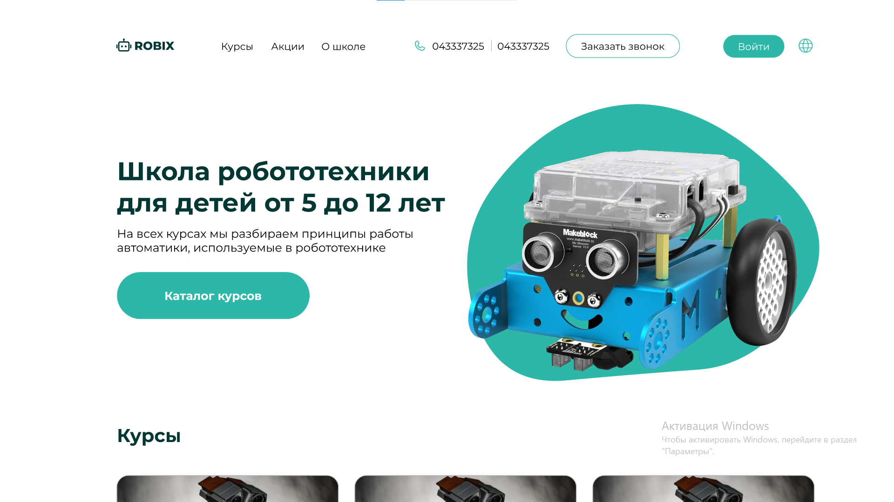

# ROBIX

A small programming school project taken from a freelance order. Deploy you can check [here](soon).

## Preview of the project

Link to Figma layout is [here](https://www.figma.com/file/CBunJ4gMEkNaMx3RhqH7B0/Robix---Design?type=design&node-id=0-1&mode=design&t=BwHZiesf4T9NcCAA-0).

---

### Technologies Used

1. BEM notation
2. SCSS

---

### Formatting rules

We use Prettier for formatting our text. See more about our configuration [here](https://frontgr.github.io/docs/prettierrc/prettierrc/).

---

Project has [MIT License](https://github.com/adkasyv/robix/blob/main/LICENSE).
